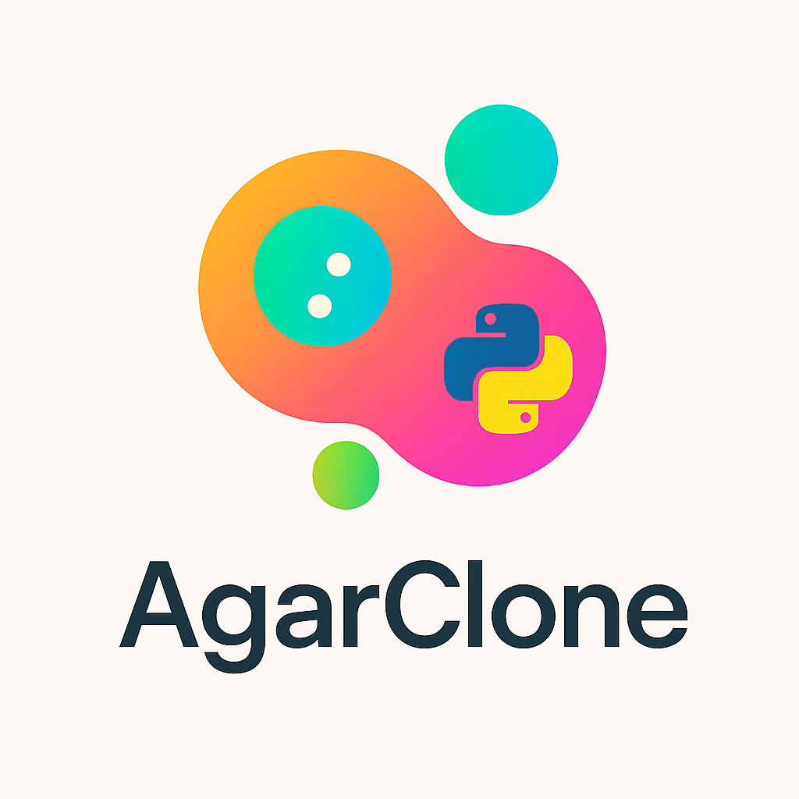

<p align="center">
  
</p>

<p align="center">
  <a href="#readme"></a>
  
  
  
  
</p>

## 🚀 Overview

> A **supercharged**, **high-octane** clone of Agar.io written in **pure Python**, featuring real-time networking, slick graphics, and endless fun!

<p align="center">
  
</p>

---

## 🐍 Tech Stack

| Component      | Technology  | Description                            |
| -------------- | ----------- | -------------------------------------- |
| 📝 Language    | Python 3.8+ | Core codebase                          |
| 🔄 Concurrency | asyncio     | Efficient event loop                   |
| 🌐 Networking  | websockets  | Real-time bi-directional communication |
| 🎨 Graphics    | pygame      | 2D rendering & input handling          |
| 🎨 Website     | django      | Website framework                      |

---

## 🗂️ Project Structure 💎

📂 **agario_clone/**

```
.
├── agario/               # Core game logic
│   ├── assets/           # Game assets (images, sounds, fonts)
│   ├── client/           # Client-side code (pygame implementation)
│   ├── server/           # Game server (WebSocket, asyncio)
│   ├── common/           # Shared modules between client and server
│   └── dist/             # Generated client .exe file (output)
│
├── web/                  # Web interface (Django)
│   └── agario_site/      # Django project configuration and app
│
├── run_client.py         # Client launcher shortcut
├── run_server.py         # Server launcher shortcut
└── requirements.txt      # Python dependencies list
```


---

## 🚀 Getting Started

```bash
# 1. Clone the repo
git clone
cd agario_clone

# 2. Install dependencies
pip install -r requirements.txt
```

---

## 🎮 Running the Game

1. **Start the server**:

   ```bash
   cd agario
   python run_server.py
   ```

2. **Launch one or more clients**:

   ```bash
   cd agario
   python run_client.py
   ```

3. **Control your cell** using **W**, **A**, **S**, **D** keys.
4. **Watch it move** courtesy of the server! 🕹️

---

## 🛠️ Features & Roadmap

- ✅ Real-time multiplayer movement
- ✅ Modular architecture: **server**, **client**, **common**
- 🚧 Collision & eating logic
- 🎯 Portals
- 🏆 Leaderboards & stats

---

## 🌐 Running the Website

AgarClone includes a Django-based web application to download the game and learn more about it. Follow these steps to run the site in development mode:

1. **Navigate to the Django project directory**

   ```bash
   cd web
   cd agario_site
   ```

2. **(Optional) Collect static files**
   If `DEBUG = False` in `settings.py`, run:

   ```bash
   python manage.py collectstatic
   ```

   In development mode (`DEBUG = True`), Django will serve static files from `main/static` automatically.


3. **Start the development server**

   ```bash
   python manage.py migrate
   python manage.py runserver
   ```

4. **Open the site in your browser**
   Visit:

   ```
   http://127.0.0.1:8000/
   ```

   You’ll see the page with a game description and a “Download” button linking to the Pygame client.

---

## 🎨 License

This project is open-sourced under the **MIT License**. See [LICENSE](LICENSE) for details.

<p align="center">
  
</p>
