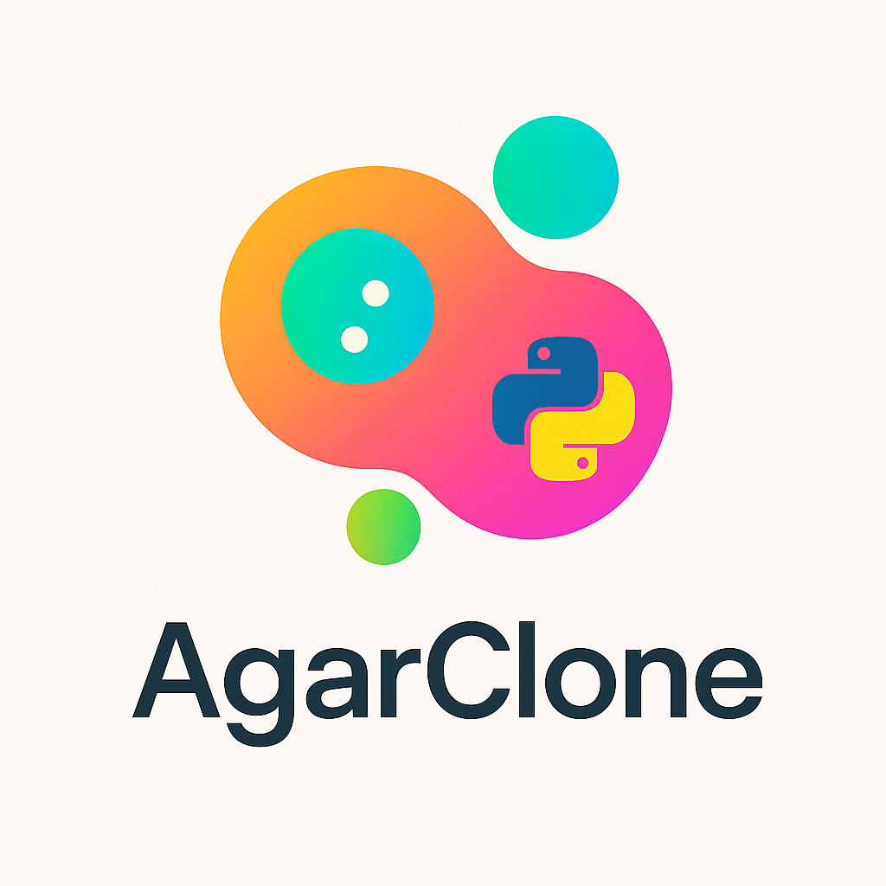
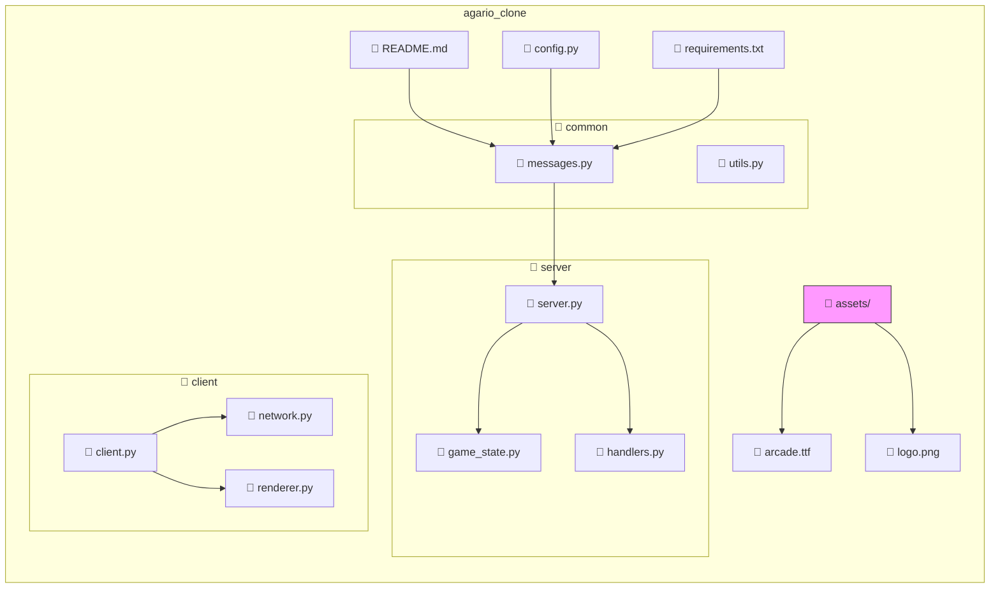

<p align="center">
  
</p>

<p align="center">
  <a href="#readme"></a>
  
  
  
  
</p>

## 🚀 Overview

> A **supercharged**, **high-octane** clone of Agar.io written in **pure Python**, featuring real-time networking, slick graphics, and endless fun!

<p align="center">
  
</p>

---

## 🐍 Tech Stack

| Component      | Technology  | Description                            |
| -------------- | ----------- | -------------------------------------- |
| 📝 Language    | Python 3.8+ | Core codebase                          |
| 🔄 Concurrency | asyncio     | Efficient event loop                   |
| 🌐 Networking  | websockets  | Real-time bi-directional communication |
| 🎨 Graphics    | pygame      | 2D rendering & input handling          |

---

## 🗂️ Project Structure 💎

📂 **agario_clone/**

```
agario_clone/
├── 📄 README.md            # Ten plik
├── 📄 requirements.txt     # Lista zależności (websockets, pygame)
├── 📄 config.py            # Konfiguracja gry (port, rozmiar okna, FPS)
├── 📁 common/              # Wspólne moduły klient–serwer
│   ├── 📄 messages.py      # Format komunikatów JSON (JOIN, MOVE, UPDATE)
│   └── 📄 utils.py         # Funkcje pomocnicze (kolizje, konwersje)
│
├── 📁 server/              # Kod serwera WebSocket
│   ├── 📄 server.py        # Uruchomienie serwera i obsługa połączeń
│   ├── 📄 game_state.py    # Klasa GameState: stan gry i logika
│   └── 📄 handlers.py      # Handlery: JOIN, MOVE, broadcast UPDATE
│
├── 📁 client/              # Kod klienta Pygame — separacja logiki
│   ├── 📄 client.py        # Punkt wejścia i pętla gry
│   ├── 📄 network.py       # Komunikacja WS (JOIN, MOVE, UPDATE)
│   └── 📄 renderer.py      # Renderowanie stanu gry w Pygame
│
└── 📁 assets/              # Zasoby (czcionki, obrazy)
    ├── 📁 fonts/
    │   └── 📄 arcade.ttf
    └── 📁 images/
        └── 📄 logo.png
```

🔗 **Flow Diagram (Mermaid)**


```mermaid
flowchart LR
  subgraph agario_clone
    direction TB
    README["📄 README.md"]
    REQS["📄 requirements.txt"]
    CFG["📄 config.py"]
    subgraph Common_Modules [📁 common]
      MSG["📄 messages.py"]
      UTIL["📄 utils.py"]
    end

    subgraph Server [📁 server]
      SVR["📄 server.py"]
      GS["📄 game_state.py"]
      HND["📄 handlers.py"]
    end

    subgraph Client [📁 client]
      CLT["📄 client.py"]
      NET["📄 network.py"]
      REN["📄 renderer.py"]
    end

    ASSET["📁 assets/"]:::asset
    FONT["📄 arcade.ttf"]
    IMG["📄 logo.png"]
  end

  README --> MSG
  CFG --> MSG
  REQS --> MSG
  MSG --> SVR
  SVR --> GS
  SVR --> HND
  CLT --> NET
  CLT --> REN
  ASSET --> FONT
  ASSET --> IMG

  classDef asset fill:#f9f,stroke:#333,stroke-width:1px;
```

---

## 🚀 Getting Started

```bash
# 1. Clone the repo
git clone https://github.com/uzytkownik/agario_clone.git
cd agario_clone

# 2. Install dependencies
pip install -r requirements.txt
```

---

## 🎮 Running the Game

1. **Start the server**:

   ```bash
   python -m server.server
   ```

2. **Launch one or more clients**:

   ```bash
   python -m client.client
   ```

3. **Control your cell** using **W**, **A**, **S**, **D** keys.
4. **Watch it move** courtesy of the server! 🕹️

---

## 🛠️ Features & Roadmap

- ✅ Real-time multiplayer movement
- ✅ Modular architecture: **server**, **client**, **common**
- 🚧 Collision & eating logic (coming soon)
- 🎯 Power-ups & special abilities
- 🌐 Multiple maps & game modes
- 🏆 Global leaderboards & stats

---

## 🌐 Running the Website

AgarClone includes a Django-based web application to download the game and learn more about it. Follow these steps to run the site in development mode:

1. **Navigate to the Django project directory**

   ```bash
   cd web
   cd agario_site
   ```

2. **Install dependencies**
   Ensure `requirements.txt` (in the “web” directory) contains `Django>=3.2`, then run:

   ```bash
   pip install -r requirements.txt
   ```

3. **(Optional) Collect static files**
   If `DEBUG = False` in `settings.py`, run:

   ```bash
   python manage.py collectstatic
   ```

   In development mode (`DEBUG = True`), Django will serve static files from `main/static` automatically.

4. **Run database migrations**
   Even if you have no custom models, it’s good practice to run:

   ```bash
   python manage.py migrate
   ```

5. **Start the development server**

   ```bash
   python manage.py runserver
   ```

6. **Open the site in your browser**
   Visit:

   ```
   http://127.0.0.1:8000/
   ```

   You’ll see the page with a game description and a “Download” button linking to the Pygame client ZIP.

---

## 🎨 License

This project is open-sourced under the **MIT License**. See [LICENSE](LICENSE) for details.

<p align="center">
  
</p>
